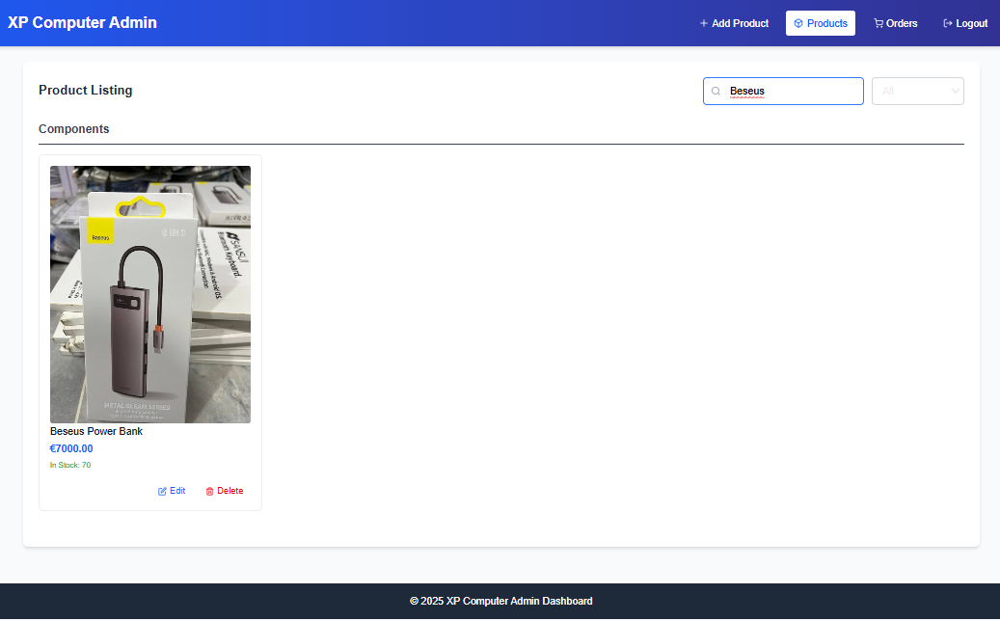
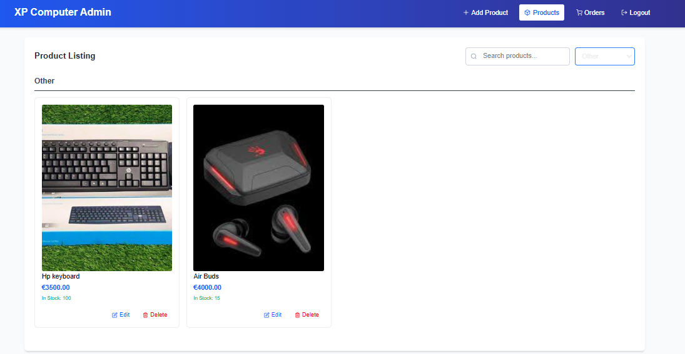

# XP Computer Web Application

Welcome to the **XP Computer** Next.js project! This repository contains a fully functional web application with:

- 🔒 Role‑based authentication (Admin & Customer)
- 🎨 Responsive, Tailwind‑CSS UI
- 📊 Informational sections (Owner, Team, Branches, Why Join Us, Testimonials)
- 📱 Sticky side panels and clean layouts
- 📁 Easy image management via the `public/assets/images` folder

---

## Table of Contents

1. [Demo](#demo)
2. [Features](#features)
3. [Tech Stack](#tech-stack)
4. [Getting Started](#getting-started)
5. [Authentication Flow](#authentication-flow)
6. [Deployment](#deployment)
7. [Admin Functionalities](#admin-functionalities)

---

## Demo

### Authentication

#### Login Page


#### SignUp Page


### Admin Functionalities

#### Add Product Page


#### View Products Page


#### Search Products by Name


#### Search Products by Category


---

## Features

- **User Signup & Login** (JWT in HTTP‑only cookies)
- **Role Guarding**: Separate dashboards for `admin` and `customer`
- **Client‑side Redirects**: Prevent back‑button access after logout
- **Informational Sections**: Owner, Manager, Team members, Branches, Why Join Us, Testimonials
- **Footer**: Contact info, quick links, social media icons
- **Mobile‑friendly**: Tailwind CSS grid and responsive utilities
- **Responsive Design**: Works seamlessly across all device sizes
- **Product Details Page**: View detailed information about a product, including images, price, description, and reviews.
- **Shopping Cart**: Add products to the shopping cart, view cart details, and proceed to checkout.
- **Product Ratings & Reviews**: Customers can leave reviews and rate products based on their experience.
- **Discounts & Coupons**: Admins can create and apply discount codes and coupons to products or orders.
- **Payment Integration**: Integration with Stripe.


---

## Tech Stack

- **Framework**: Next.js App Router
- **UI**: React, Tailwind CSS
- **State**: React Context API
- **API Requests**: Axios
- **Auth**: JWT with HTTP‑only cookies
- **Database**: MongoDB via Mongoose
- **Payment Gateway**: Stripe/PayPal
- **Email Service**: Nodemailer (for order confirmations and alerts)

---

## Getting Started

### Prerequisites

- Node.js v16+
- npm or Yarn

### Installation

1. **Clone** the repo:
   ```bash
   git clone https://github.com/MuhammadMahi585/Xp
   cd Xp
Install dependencies:

bash
Copy
Edit
npm install
Configure environment:

Copy .env.sample to .env.local

Fill in your MongoDB URI, JWT_SECRET, Stripe API Key, and PayPal API Key

Run the app:

bash
Copy
Edit
npm run dev
Open http://localhost:3000 in your browser.

Authentication Flow
Signup (/signup): Registers user, sets JWT cookie.

Login (/login): Authenticates, sets JWT cookie, redirects based on role.

AuthProvider: On app load, calls /api/authentication/admin to verify JWT and initialize React Context.

Protected Routes: Each dashboard watches auth state and router.replace to prevent unauthorized/back navigation.

Logout: Calls /api/authentication/logout, clears cookie, forces redirect and page reload.

Admin Functionalities
Admins have access to manage the following:

Manage Products: Add, update, delete products.

Manage Categories: Add, update, delete product categories.

Manage Users: View and manage customer accounts.

Order Management: View and manage customer orders, update their status (e.g., pending, shipped, delivered).

Analytics Dashboard: View key metrics like total sales, products sold, customer activity, etc.

Create Coupons: Generate discount codes and apply them to products or orders.

Email Notifications: Send order confirmation, shipping updates, and other customer notifications.

Additional eCommerce Features
Product Details Page: Customers can view detailed information about a product.

Shopping Cart: Customers can add products to their shopping cart and proceed to checkout.

Order History: View and manage previous orders.

Wishlist: Save favorite products for future purchase.

Discounts & Coupons: Apply promo codes at checkout.

Payment Integration: Secure payments using Stripe or PayPal.

Email Notifications: Receive order confirmations, shipping updates, etc.

Multi-language Support: Enable users to switch between different languages.

Product Availability Alerts: Get notified when products are back in stock.


Keep names descriptive and avoid spaces.

Deployment
I will deploy this app on vercel


