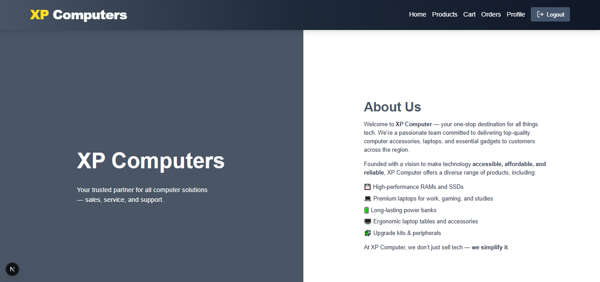
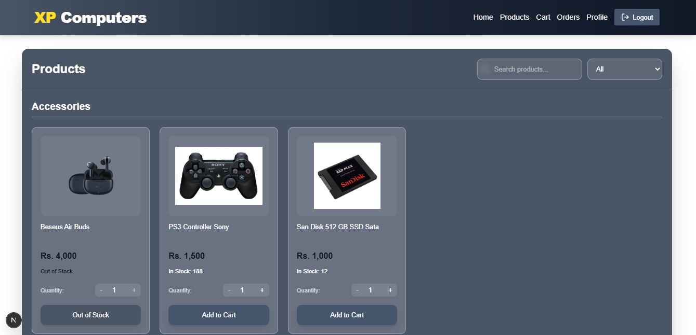
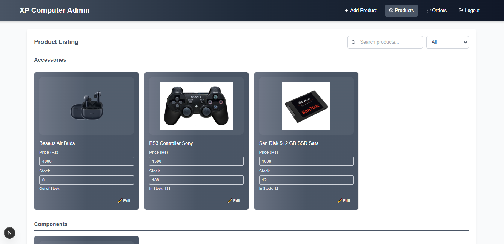
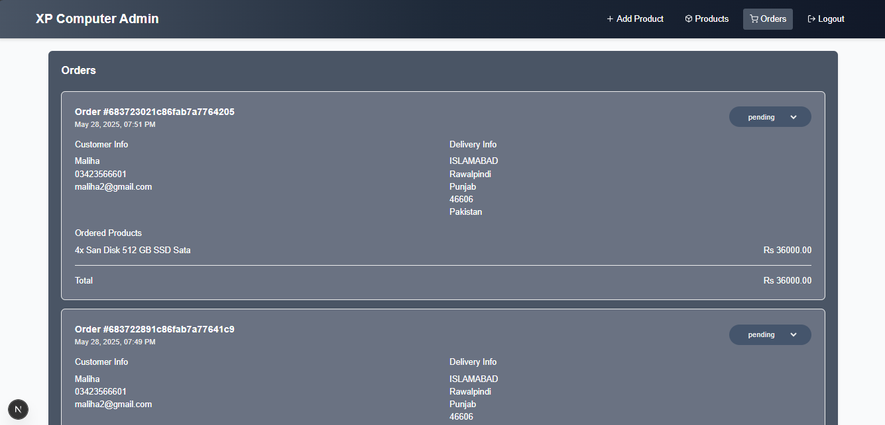

# XP Computer Web Application

Welcome to the **XP Computer** Next.js project! This repository contains a fully functional web application with:

- 🔒 Role‑based authentication (Admin & Customer)
- 🎨 Responsive, Tailwind‑CSS UI
- 📊 Informational sections (Owner, Team, Branches, Why Join Us, Testimonials)
- 📱 Sticky side panels and clean layouts
- 📁 Easy image management via the `public/assets/images` folder

---
### You can visit website by clicking on link below
xpcomputers.shop

## Table of Contents

1. [Demo](#demo)
2. [Features](#features)
3. [Tech Stack](#tech-stack)
4. [Getting Started](#getting-started)

---

## Demo

### Authentication

#### Login Page


#### SignUp Page


### Customer Functionalities

#### Home Page 


#### Product View Page 


#### Product Search Page 


#### Cart Page 


#### Orders Page 


#### User Profile Page


### Admin Functionalities

#### Add Product Page


#### View Products Page


#### Search Products by Name


#### Search Products by Category


#### Orders Page


---

## Features

# Functional Features
- **User Signup & Login** (JWT in HTTP‑only cookies)
- **Role Guarding**: Separate dashboards for `admin` and `customer`
- **Product Details Page**: View detailed information about a product, including images, price, description, and stock.
- **Shopping Cart**: Add products to the shopping cart, view cart details.
- **Place Order**: Place Order by entering the address of delievery.
- **Search**: Searh Product by Name and category.
- **Profile***: Seperate Page for user Profile.

# Additional Feature
- **Informational Sections**: Owner, Manager, Team members, Branches, Why Join Us, Testimonials
- **Footer**: Contact info, quick links, social media icons
- **Mobile‑friendly**: Tailwind CSS grid and responsive utilities
- **Responsive Design**: Works seamlessly across all device sizes


---

## Tech Stack

- **Framework**: Next.js App Router
- **UI**: React, Tailwind CSS
- **State**: React Context API
- **API Requests**: Axios
- **Auth**: JWT with HTTP‑only cookies
- **Database**: MongoDB via Mongoose
- **Payment Gateway**: Stripe


---

## Getting Started

### Prerequisites

- Node.js v16+
- npm or Yarn

### Installation

1. **Clone** the repo:
   ```bash
   git clone https://github.com/MuhammadMahi585/Xp
   cd Xp
## Install dependencies:

npm i

## Run the website

npm run dev


